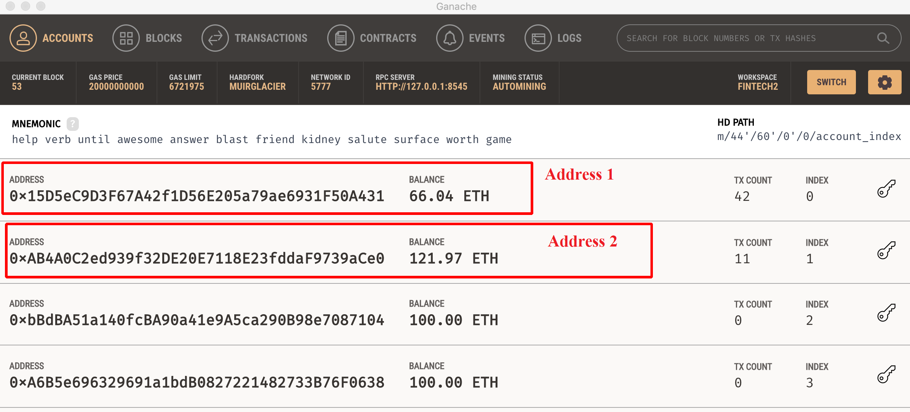

## Summary

- Connected to Ganache local port using Web3

- Used python to access ETH and BTC accounts in Web3 from Nmemonic/Secret seed phrase 

- Used python to access accounts in Web3 from Private keys

- Using load_env Load and set environment variables from .env 

- Understanding of BIP32, BIP39, and BIP44

- Worked with [`bit`](https://ofek.github.io/bit/) Python Bitcoin library to send crypto and view balances

- Worked with [`web3.py`](https://github.com/ethereum/web3.py) Python Ethereum library to estimate gas, create Raw transaction, sign the transaction and send transaction
- View the results on Ganache for Web3
- Worked with Faucets to get test BTC

### Ganache connections

Screenshot of Ganache Accounts before doing any transactions.

We will be using Account 1 and Account 2 for transaction.

### Python Jupyter code

[Jupyter Notebook Wallet.ipynb](https://github.com/rchak007/PythonWeb3BitTransactions/blob/main/wallet.ipynb)

### Web3 transaction

### Viewing transactions on Ganache

### Mnemonic Code Converter

Generating Bitcoin Test accounts from Mnemonic

Derivation Path for BTC testnet

### Deriving Address 

### Python Bit transactions

Below we use the 2 addresses we derived and use it for transfer using Bit

We use wif_to_key to get the BTC address from private key

### Faucets

Bitcoin Testnet faucets to request tokens:

* https://bitcoinfaucet.uo1.net/

* https://kuttler.eu/en/bitcoin/btc/faucet/

* https://testnet-faucet.mempool.co/

* https://testnet.help/en/btcfaucet/testnet

