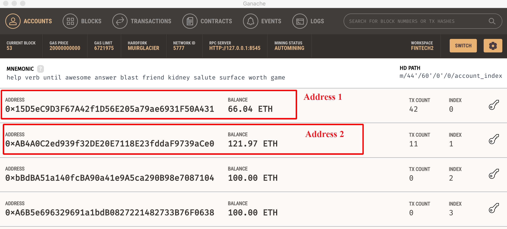
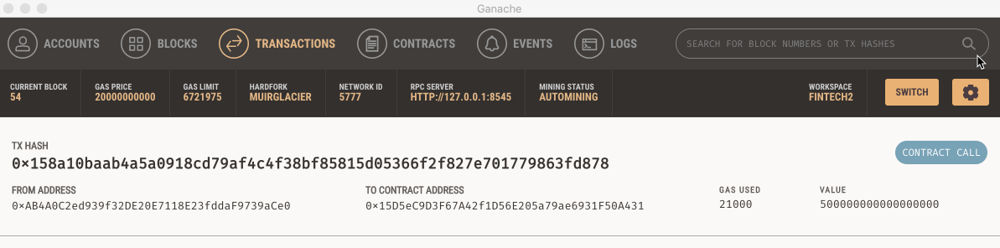
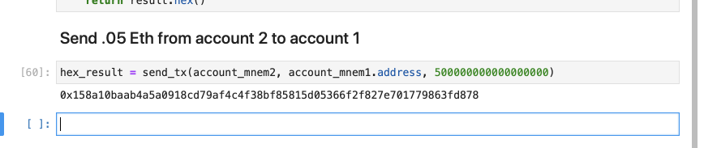
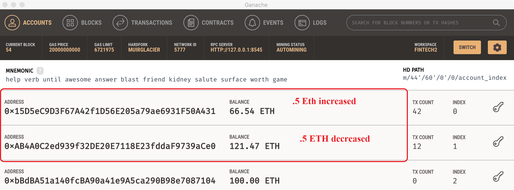

Screenshot of Ganache Accounts before doing any transactions.

We will be using Account 1 and Account 2 for transaction.

Jupyter Notebook - wallet.ipynb

Jupyter Notebook module - constants.ipynb

Jupyter code for transaction execution; 

